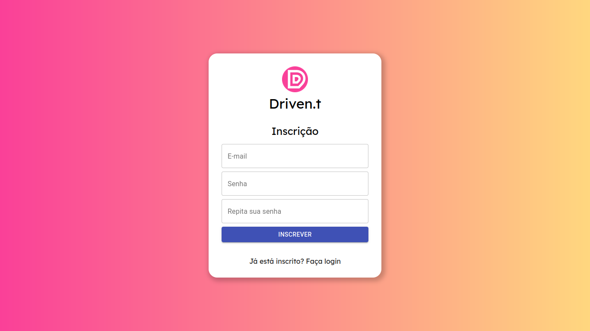
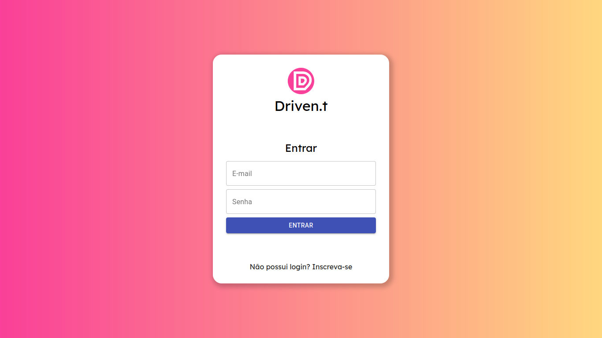
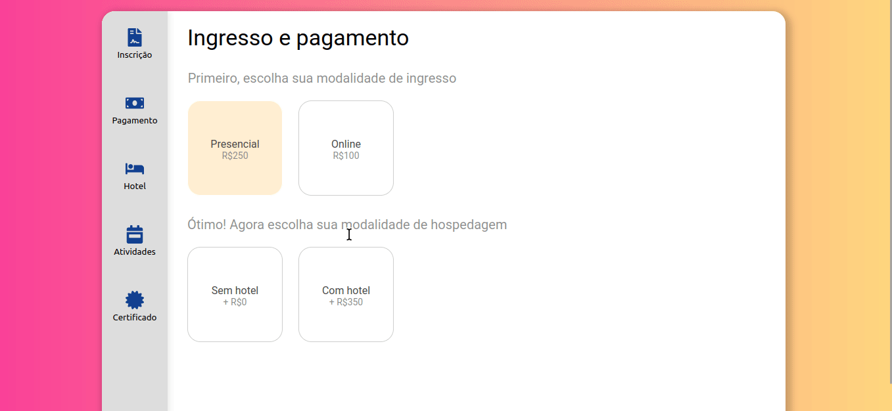
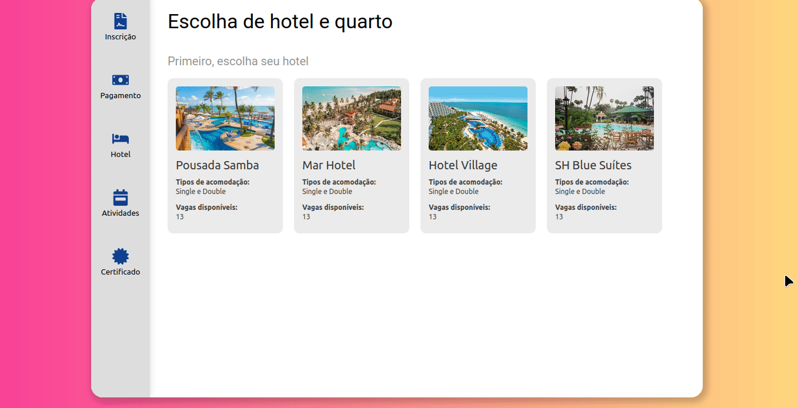
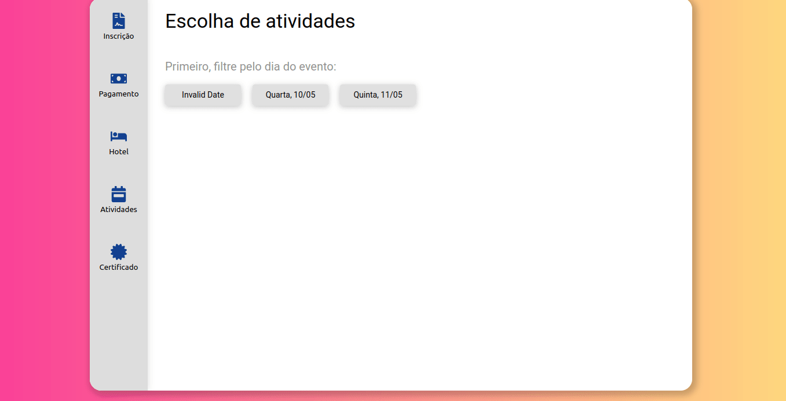

# drivent-front

Front-end for Driven.t, an event management solution.

## About

Driven.t is a web browser application with which you can manage every single aspect of your event.

<details>
    <summary>Sign up</summary>


</details>

<details>
    <summary>Login</summary>


</details>

<details>
    <summary>Payment</summary>


</details>

<details>
    <summary>Booking</summary>


</details>

<details>
    <summary>Activities</summary>


</details>

## Technologies
Some of the main technologies used in this project.<br/><br/>
Front-end:<br/>
<div>
    
    
    
    
    
</div>

<br/>Back-end:<br/>
<div>
    
    
    
    
    
</div>


## How to run for development

1. Clone this repository
2. Install all dependencies

```bash
npm i
```

3. Populate `.env` file based on `.env.example`. `REACT_APP_API_BASE_URL` should point to your API server (driven.t-back)

4. Run the back-end in a development environment:

```bash
npm start
```

## Building and starting for production

```bash
npm run build
npm start
```

## Running application locally or inside docker

`.env.development` and `.env.test` must be changed if you and to run the application locally or inside docker. You can populate files based on `.env.example` file, but you need to consider the following:

- Running application locally (postgres and node):

Add your postgres credentials and make sure to create given database before running the application.

- Running application inside docker (postgres and node):

Set `POSTGRES_HOST` to `drivent-postgres-development` for `.env.development` and `drivent-postgres-test` for `.env.test` file. It is the name of the postgres container inside docker-compose file. Docker Compose will start the postgres container for you, create the database and host alias for you.

- Running application locally (node) but postgres is running inside docker:

Set `POSTGRES_HOST` to `localhost` for `.env.development` and `localhost` for `.env.test` file. Docker compose is configured to expose postgres container to your localhost.

## What to do when add new ENV VARIABLES

Please notice that every ENV that should be available on browser should start with `REACT_APP_` prefix. There are several things you need to do when you add new ENV VARIABLES:

- Add them to `.env.example` file
- Add them to your local `.env` file
- Add them to your docker-compose.yml file (just the name, not the value). Only envs listed in the environment section will be exposed to your docker container.
- Add them (prod version) to your github repo secrets. They will be used to generate the `.env` file on deploy.
